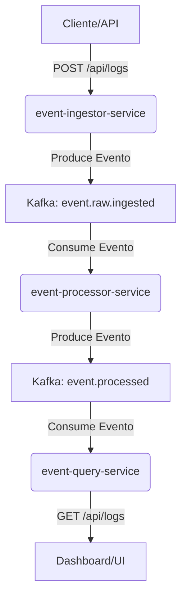

# 🚀 Log Management System

[](https://openjdk.org/)
[](https://spring.io/projects/spring-boot)
[](https://kafka.apache.org/)
[](LICENSE)

**Log Management System** es una plataforma modular y distribuida para la **ingesta**, **preprocesamiento** y **gestión de eventos de log en tiempo real**, construida con **Spring Boot** y **Apache Kafka**.

---

## 📑 Tabla de Contenidos
- [✨ Descripción](#-descripción)
- [🏗 Arquitectura](#-arquitectura)
- [🛠 Tecnologías](#-tecnologías)
- [⚙️ Configuración](#️-configuración)
- [🧪 Uso de la API](#-uso-de-la-api)
- [📜 Licencia](#-licencia)

---

## ✨ Descripción
El sistema está diseñado para desacoplar el flujo de datos y manejar grandes volúmenes de eventos de manera **asíncrona** y **escalable**.  
Consta de **3 microservicios**:

1. **`event-ingestor-service`**  
   Recibe eventos vía API REST, aplica **hashing y cifrado**, y los envía a **Kafka**.
2. **`event-processor-service`** *(Planificado)*  
   Procesa y enriquece eventos desde Kafka y los publica en otro topic.
3. **`event-query-service`** *(Planificado)*  
   Exposición de API para consultas y visualización de logs.

---

## 🏗 Arquitectura
Basada en **Event-Driven Architecture** con Kafka como bus central:



---

## 🛠 Tecnologías
- **Java:** 21+
- **Framework:** Spring Boot 3.x
- **Mensajería:** Apache Kafka
- **Dependencias:** Maven, Lombok
- **Herramientas:** Docker, Docker Compose
- **Testing:** JUnit, MockMVC *(futuro)*

---

## ⚙️ Configuración
<details>
<summary><b>1. Prerequisitos</b></summary>

- JDK **21+**
- Maven **3.x+**
- Docker & Docker Compose
- Git
- Postman/Insomnia
</details>

<details>
<summary><b>2. Levantar Kafka con Docker Compose</b></summary>

```bash
docker-compose up -d
docker ps
```
</details>

<details>
<summary><b>3. Ejecutar Microservicio Ingestor</b></summary>

```bash
git clone https://github.com/HarolRiosDev/log-management-system.git
cd log-management-system/event-ingestor-service

mvn clean package
java -jar target/event-ingestor-service-0.0.1-SNAPSHOT.jar
```

O:

```bash
mvn spring-boot:run
```
</details>

---

## 🧪 Uso de la API
- **Base URL:** `http://localhost:8080/api`
- **Swagger UI:** `http://localhost:8080/swagger-ui.html`

### ➕ Enviar un Log
```bash
curl -X POST "http://localhost:8080/api/logs" -H "Content-Type: application/json" -d '{
  "level": "INFO",
  "message": "User login successful",
  "sourceIp": "192.168.1.5"
}'
```

### 🔄 Enviar Lote de Logs
```bash
curl -X POST "http://localhost:8080/api/logs/batch" -H "Content-Type: application/json" -d '[
  {
    "level": "WARN",
    "message": "API call exceeded rate limit",
    "sourceIp": "203.0.113.10"
  },
  {
    "level": "ERROR",
    "message": "Database connection failed",
    "sourceIp": "172.16.254.1"
  }
]'
```

### ✅ Verificar en Kafka
```bash
kafka-console-consumer.sh --bootstrap-server localhost:9092 --topic event.raw.ingested --from-beginning
```

---

## 📜 Licencia
Este proyecto está bajo la [Licencia Apache 2.0](LICENSE).
