# 🚀 Log Management System

log-management-system es una plataforma modular y distribuida para la ingesta, pre-procesamiento y gestión de eventos de log en tiempo real. Construido con Spring Boot y Apache Kafka, este sistema está diseñado para desacoplar el flujo de datos y manejar grandes volúmenes de eventos de manera asíncrona y escalable.

---

## 🌟 Descripción del Proyecto

El sistema se compone de tres microservicios principales:

1.  **`event-ingestor-service`**: Recibe eventos de log a través de una API REST, aplica transformaciones de seguridad (hashing de IPs, cifrado de mensajes) y los publica en un topic de Kafka.
2.  **`event-processor-service`**: (Planificado) Consumirá los eventos del topic de ingesta, aplicará lógica de negocio avanzada (ej. enriquecimiento de datos, validaciones adicionales) y los publicará en un topic final para almacenamiento.
3.  **`event-query-service`**: (Planificado) Expondrá una API para consultar los logs procesados y almacenados, permitiendo su visualización y análisis.

## 🚀 Arquitectura del Sistema

La arquitectura sigue el patrón de "Event-Driven Architecture", utilizando Kafka como el bus de eventos central para garantizar un procesamiento asíncrono y una alta disponibilidad.

```mermaid
graph TD
    A[Aplicación Cliente] -->|POST /api/logs| B(event-ingestor-service);
    B -->|Produce Evento| C[Kafka Topic: event.raw.ingested];
    C -->|Consume Evento| D(event-processor-service);
    D -->|Produce Evento| E[Kafka Topic: event.processed];
    E -->|Consume Evento| F(event-query-service);
    F -->|GET /api/logs| G[Panel de Control/UI];
```


---

## 🛠️ Tecnologías Utilizadas

* **Lenguaje:** Java 21+
* **Framework:** Spring Boot 3.x
* **Mensajería: **Apache Kafka
* **Gestor de Dependencias:** Maven
* **Servicios Web:** Spring Web (RESTful API)
* **Utilidades:** Project Lombok (para reducir boilerplate)
* **Herramientas de Desarrollo:** Spring Boot DevTools

---

## 🔧 Configuración del Entorno de Desarrollo

Sigue estos pasos para levantar y probar el servicio localmente.

### 1. Prerequisitos

Asegúrate de tener instalado en tu sistema:

* JDK 21+
* Maven 3.x+
* Git
* Un IDE (IntelliJ IDEA, VS Code, Eclipse)
* Postman o Insomnia (para probar la API)
* Docker

### 2. Puesta en Marcha de Kafka con Docker Compose

Para que el event-ingestor-service pueda publicar mensajes, necesitas un broker de Kafka y Zookeeper en funcionamiento. Usa el archivo docker-compose.yml para levantarlos fácilmente:

```bash
cd log-management-system
docker-compose up -d```

Verifica que los contenedores estén corriendo con docker ps

### 3. Construcción y Ejecución de los Microservicios

```bash

# Clona el repositorio
git clone [https://github.com/HarolRiosDev/log-management-system.git](https://github.com/HarolRiosDev/log-management-system.git)
cd log-management-system

# Navega a la carpeta del servicio de ingesta
cd event-ingestor-service

# Compila y empaqueta el servicio en un JAR
mvn clean package

# Ejecuta el servicio
java -jar target/event-ingestor-service-0.0.1-SNAPSHOT.jar
```
Alternativamente, puedes usar el plugin de Spring Boot para ejecutarlo directamente:

```
# En la carpeta event-ingestor-service
mvn spring-boot:run
```


## 🧪 Uso de la API (Ingestor)
Con el event-ingestor-service y Kafka corriendo, puedes usar cURL o un cliente REST como Postman para enviar eventos de log.

El servicio expone la API en http://localhost:8080/api y puedes explorar la documentación interactiva en http://localhost:8080/swagger-ui.html.

Ingresar un evento de log individual

```
curl -X POST "http://localhost:8080/api/logs" \
-H "Content-Type: application/json" \
-d '{
  "level": "INFO",
  "message": "User login successful",
  "sourceIp": "192.168.1.5"
}'
```

Ingresar eventos de log por lotes

```
curl -X POST "http://localhost:8080/api/logs/batch" \
-H "Content-Type: application/json" \
-d '[
  {
    "level": "WARN",
    "message": "API call exceeded rate limit",
    "sourceIp": "203.0.113.10"
  },
  {
    "level": "ERROR",
    "message": "Database connection failed",
    "sourceIp": "172.16.254.1"
  }
]'
```

Verificación de Mensajes en Kafka
Puedes usar la herramienta de línea de comandos de Kafka para verificar que los mensajes se están publicando en el topic. Asegúrate de tener los ejecutables de Kafka en tu PATH.
```
# Asumiendo que Kafka está en http://localhost:9092
kafka-console-consumer.sh --bootstrap-server localhost:9092 --topic event.raw.ingested --from-beginning
```

## 📝 Licencia
Este proyecto está bajo la Licencia Apache 2.0.
